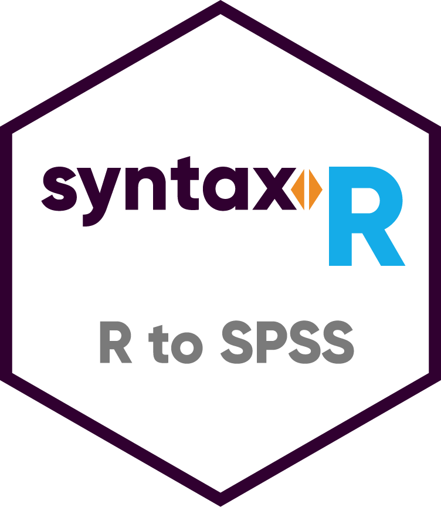

## syntaxr 
An R package for generating bulk SPSS syntax from the R environment.

[](https://travis-ci.org/greenmeen/syntaxr)
[](https://codecov.io/github/greenmeen/syntaxr?branch=master)
[](https://www.repostatus.org/#inactive)
[](https://cran.r-project.org/package=syntaxr)
[](https://cranlogs.r-pkg.org/badges/grand-total/syntaxr?color=blue)
[](https://opensource.org/licenses/MIT)
[](https://zenodo.org/badge/latestdoi/172167863)

**Note : Due to personal events in the past year, I am no longer working on developing further releases for the package. Recent updates to dependencies might or might not lead to broken code - please use at your own risk. If you run into problems, you can create an issue here on GitHub, or get in touch with me directly. I'll try to address it as soon as possible.**

#### Description
`syntaxr` provides overall enhanced flexibility for variable manipulation, and facilitates the streamlining of SPSS dataset transformation. This package was designed for systematic transformation of variables, and is especially suited for large datasets that don't lend themselves to easy bulk manipulation.
It can also be used to selectively apply SPSS functions to variables, according to simple or complex criteria.

#### Installation
- Recommended installation is through CRAN : `install.packages('syntaxr')`.
- Alternatively, the latest development version can be installed with devtools : `devtools::install_github("greenmeen/syntaxr")`.

### Usage
#### 1. Importing SPSS data (optional)
Here's some sample code that asks the user to select an SPSS datafile, loads the data with the `haven` package, and extracts variable names and types. You can also use the `foreign` package.
```r
# Load haven and select a file
library('haven')
dataset <- haven::read_spss(choose.files())

# Extract the vector containing all the variable names
vars <- names(dataset)
# Obtain the class of the first element of each variable
types <- lapply(dataset, function(x) class(x[[1]][[1]]))

# Summarize the information in a table
summary_table <- cbind(vars, types, make.row.names = FALSE)
colnames(summary_table) <- c("Variable Name", "Variable Type")
```

#### 2. Functions available

- Here is the list of the base SPSS functions that are currently supported by `syntaxr` :

| SPSS syntax function |`syntaxr` function      | Additional information                |
|---------------------:|:----------------------:|:--------------------------------------|
|              concat()|`spss.format.concat()`  |Called by other functions (only)       |
|                 max()|`spss.format.max()`     |Called by other functions (only)       |
|               rtrim()|`spss.rtrim()`          |Used within other functions            |
|               COMPUTE|`spss.format.compute()` |Requires a call to a format function** |
|                STRING|`spss.string()`         |                                       |
|      RENAME VARIABLES|`spss.rename()`         |                                       |

** `spss.format.compute()` takes two arguments : the name of the computed variable, and the computation. The computation needs to have been formatted already (see function examples). I'm currently developing a feature where the function could take as argument a list that contains a regex and the necessary arguments, though that's still only an idea.

- Additionally, the following functions are also available :

| SPSS syntax function    |`syntaxr` function      | Additional information                                         |
|------------------------:|:----------------------:|:---------------------------------------------------------------|
|    COMPUTE _var_ = max()|`spss.compute.max()`    |                                                                |
| COMPUTE _var_ = concat()|`spss.compute.concat()` |Assumes the new STRING already exists                           |
|                         |`spss.concat.new()`    |Generates syntax using `spss.string()` to create a STRING first |
